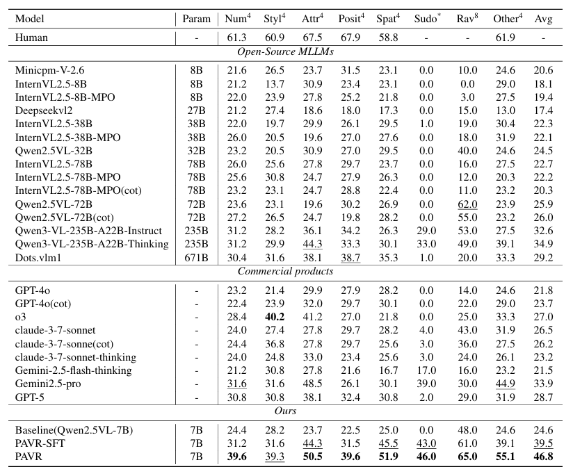
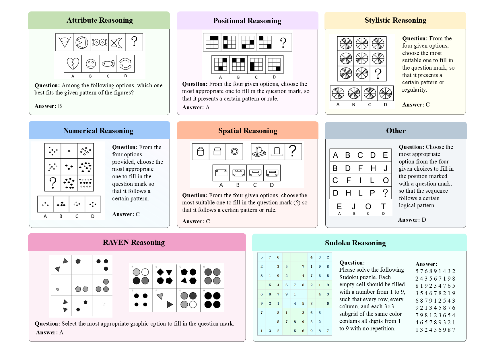

<p align="center">

  <h2 align="center"><strong>VisuRiddles: Fine-grained Perception is a Primary Bottleneck for Multimodal Large Language Models in Abstract Visual Reasoning</strong></h2>

<p align="center">
        🌐 <a href="https://zhd36.github.io/VisuRiddles/"><b>Homepage</b></a>&nbsp&nbsp | &nbsp&nbsp🤗 <a href="https://huggingface.co/datasets/yh0075/VisuRiddles"><b>Hugging Face</b></a>&nbsp&nbsp | &nbsp&nbsp📑 <a href="https://arxiv.org/abs/2506.02537"><b>Paper</b></a>&nbsp&nbsp
</p>


# 👋 Introduction
Recent strides in multimodal large language models (MLLMs) have significantly advanced their performance in many reasoning tasks. However, Abstract Visual Reasoning (AVR) remains a critical challenge, primarily due to limitations in perceiving abstract graphics. To tackle this issue, we investigate the bottlenecks in current MLLMs and synthesize training data to improve their abstract visual perception. First, we propose VisuRiddles, a benchmark for AVR, featuring tasks meticulously constructed to assess models' reasoning capacities across five core dimensions and two high-level reasoning categories. Second, we introduce the Perceptual Riddle Synthesizer (PRS),  an automated framework for generating riddles with fine-grained perceptual descriptions. PRS not only generates valuable training data for abstract graphics but also provides fine-grained perceptual description, crucially allowing for supervision over intermediate reasoning stages and thereby improving both training efficacy and model interpretability. Our extensive experimental results on VisuRiddles empirically validate that fine-grained visual perception is the principal bottleneck and our synthesis framework markedly enhances the performance of contemporary MLLMs on these challenging tasks.


# 🔥 News


- **[`04/06/2025`]**: Release the [dataset](https://huggingface.co/datasets/yh0075/VisuRiddles) and evaluation script.
- **[`04/06/2025`]**: Our paper is now accessible at [arXiv]().

# 📌 Highlights


- **We introduce VisuRiddles, a multi-dimensional benchmark for abstract visual reasoning (AVR).** It systematically covers five key perceptual dimensions—numerosity, attribute, style, position, and spatial relation—as well as high-level analogical and consistency-based reasoning.

- **State-of-the-art MLLMs perform near random on AVR tasks.** Experiments reveal that the main bottleneck lies in fine-grained perceptual understanding of complex structures, rather than reasoning alone.

- **Fine-grained perceptual descriptions significantly boost model performance.** Recasting abstract graphics into perceptual terms enables MLLMs to solve AVR tasks much more accurately, underscoring the importance of perceptual ability.

- **We develop an automated synthesis framework for fully-annotated AVR samples.** This enables end-to-end supervision from perception to reasoning, facilitating more systematic model learning and generalization.

# ✅ To-do
- [ ] Release synthesis code (e.g., positiona and stylistic rule)
- [ ] Release the validation dataset with perceptual description

# 🔨 Evaluation
You can use either of the following files for inference, depending on your needs:

- **run_offline.py**: For open-source model inference (offline, local).
- **run_online.py**: For closed-source model inference using the Yunwu API (online/cloud).  
  > Yunwu API: [https://yunwu.ai.com/](https://yunwu.ai.com/)

You can choose one of the following ways to run the inference:

## Option 1: Run a Single Model via Bash Script
You can directly run a single model inference using a bash script. For example, to run inference with GPT-4o:
```bash
python evaluate/metric_cal.py --result_file /path/to/your/result.json
```

Both scripts will generate a result file containing model predictions.After inference, use the evaluation script to calculate metrics:

```bash
bash scripts/online/inference_gpt4o.sh
```
Feel free to modify the script or create new ones for different models as needed.

## Option 2: Run Multiple Models in Parallel via Python
You can also run multiple model inference scripts in parallel using `run_online.py`. To do this, modify the `scripts`parameter in the Python script. For example:
```bash
scripts = [
    './scripts/online/inference_gpt4o.sh',
    './scripts/online/inference_claude.sh'
]
```
Then, run the script with:
```bash
python run_online.py
```

Replace /path/to/your/result.json with the path to your actual result file.The script outputs accuracy for each task category and overall performance.


# 📖 Main Results



# 🧩Dataset Overview
## Examples 


## Dataset Structure
The structure of this VisuRiddles is shown as follows.
```
VisuRiddles
│
├── images                          # Main folder for all visual riddle images
│
└── VisuRiddles.json                # Annotation file for the entire dataset

```

## Data Instances
For each instance in the dataset, the following fields are provided:
```
json
{
    {
        "id": "0000",
        "question": "[Logical Reasoning]  \nFrom the four given options, choose the most suitable one to fill in the question mark so that it demonstrates a certain pattern or regularity:",
        "imgs": [
            "images/ningxia/2013_92.png"
        ],
        "option": "A、A\nB、B\nC、C\nD、D",
        "gold_answer": "A",
        "gold_analysis": "Element set form, examining the number of types of elements. It is known that each figure contains four different types of elements, and each figure includes the same element: a five-pointed star. Option A contains four different types of elements and includes one five-pointed star; options B and C do not have a five-pointed star; option D has only three different types of elements.  \nTherefore, the correct answer is A.",
        "class": "Numerical"
    },
  ...
}

```
## Data Fields
- `id`: a string containing the unique identifier for the question sample.
- `question`: a string containing the main question or instruction for the logical reasoning task.
- `imgs`: a list of strings, where each string is the relative path to an image file associated with the question (e.g., `images/ningxia/2013_92.png`).
- `option`: a string listing all answer options, typically formatted with option labels (e.g., "A、A\nB、B\nC、C\nD、D").
- `gold_answer`: a string indicating the correct answer option (e.g., "A").
- `gold_analysis`: a string providing the detailed explanation or reasoning for the correct answer.
- `class`: a string representing the type or category of the question (e.g., "Numerical", "Attribute", etc.).


# ✒️Citation

If you find VisuRiddles helpful, please consider giving this repo a :star: and citing:

```latex
@misc{yan2025visuriddlesfinegrainedperceptionprimary,
      title={VisuRiddles: Fine-grained Perception is a Primary Bottleneck for Multimodal Large Language Models in Abstract Visual Reasoning}, 
      author={Hao Yan and Handong Zheng and Hao Wang and Liang Yin and Xingchen Liu and Zhenbiao Cao and Xinxing Su and Zihao Chen and Jihao Wu and Minghui Liao and Chao Weng and Wei Chen and Yuliang Liu and Xiang Bai},
      year={2025},
      eprint={2506.02537},
      archivePrefix={arXiv},
      primaryClass={cs.CV},
      url={https://arxiv.org/abs/2506.02537}, 
}
```

Thanks for your support!


